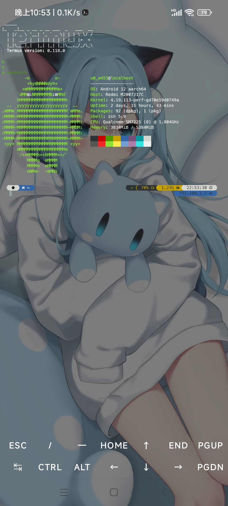

# NTermux
> 这不是[官方的Termux版本](https://github.com/termux/termux-app)！
>
> 目前仅支持arm64-v8a架构！
>
> 同步自上游版本`v0.118.0`.

## 截图

## 下载
[Releases](https://github.com/Anng6/NTermux/releases)

## 版本功能:
- 引导包美化(ohmyzsh+p10k主题,命令高亮补全,一些偏好配置等)[2024.07.21]✓
- 终端美化(旧版配色,灰色背景,快捷键沉浸)✓
- 集成Termux:API✓
- 自定义横竖屏背景图(默认猫羽雫)✓
- 生物身份验证✓
- 解除安卓12+的32进程限制(需Root)✓
- GUI版备份/恢复功能(tb命令)✓
- 去除终端数量限制✓
- 一些优化(sh链接至bash,which修复,home权限等)✓
- .......

## 画饼:
- 集成x11×
- 云端命令x

## 随缘更新

By 安宁
